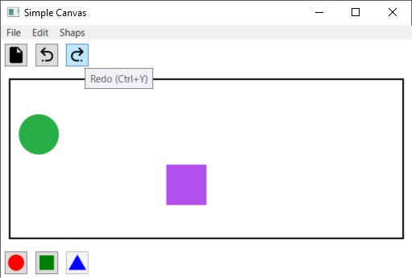

# CommandDemoWpf
This is sample project with implemented basic "desktop" program commands: New, Undo and Redo. Additional is defined Custom Commands to fast select shape (Circle, Square & Triangle). All of commands you can perform form Top Menu, Buttons and keyboard shortcut.

## All screenshots

### 1 - Sample 3 components placed

### 2 - After 2 times Undo

### 3 - After 1 time Redo

